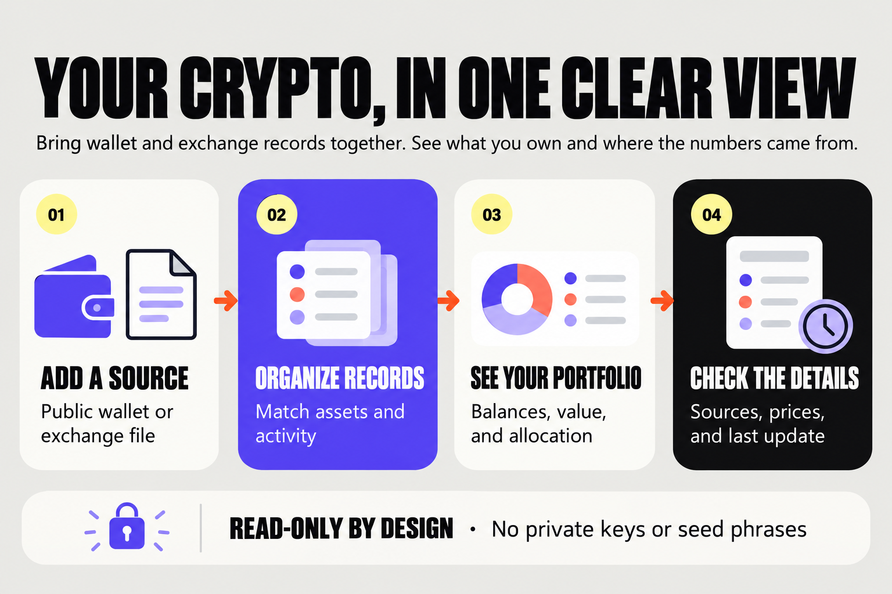

# PocketOrbit

> **Your crypto, in one clear view.**

PocketOrbit helps you understand crypto held across public wallets and exchange records. It brings balances and transaction records into one portfolio view and shows where the information came from and when it was updated.



## What you can do

- **Connect a public wallet.** PocketOrbit reads balances from supported Solana and EVM networks. It cannot move crypto.
- **Import an exchange CSV.** Save transaction history as activity or import current exchange balances as holdings that are clearly marked for review.
- **See a saved portfolio.** Wallet syncs create timestamped snapshots. Imports and wallet sources belong to your account.
- **Check the details.** Prices show their provider and update time. Old, missing, unmatched, or incomplete data is labeled.

Transaction history does not establish current holdings when rows are missing, and it may overlap wallet balances. Balance statements can populate holdings, but they are user-provided and are not independently verified. PocketOrbit keeps these portfolios marked partial instead of presenting them as complete.

## Try the sample

The public demo is illustrative. Sample balances, prices, and activity do not come from live accounts. To save a portfolio, create an account after configuring the API database and wallet providers.

## Run locally

Requirements: Node.js 20.9 or newer, pnpm, Python 3.11 or newer, and [uv](https://docs.astral.sh/uv/).

From the repository root in PowerShell:

```powershell
if (-not (Test-Path apps/web/.env.local)) { Copy-Item apps/web/.env.example apps/web/.env.local }
if (-not (Test-Path apps/api/.env)) { Copy-Item apps/api/.env.example apps/api/.env }
pnpm install
```

Set `DATABASE_URL` to a PostgreSQL database in `apps/api/.env`, configure a unique local `SECRET_KEY`, then apply the schema:

```powershell
uv run --directory apps/api alembic upgrade head
```

Start the API in one terminal and the web app in another:

```powershell
pnpm dev:api
```

```powershell
pnpm dev
```

Open `http://localhost:3000`. The API docs are at `http://localhost:8000/docs`. Configure server-side RPC endpoints and a CoinGecko API key to use live wallet balances and prices. Set `ALCHEMY_API_KEY` for indexed ERC-20 discovery on Ethereum, Base, and Arbitrum. PocketOrbit tries the indexed RPC method first, then Alchemy's Portfolio API; chain RPCs remain primary for block-pinned balances. If neither indexed source is available, it falls back to configured token contracts and labels the snapshot partial. See [`docs/API.md`](docs/API.md) for setup and coverage details.

## What is implemented

PocketOrbit has account registration and login, ownership-checked portfolios, saved public-wallet sources, timestamped balance snapshots, CSV transaction and balance imports, import history and removal, current-price lookup for identified assets, and a dashboard connected to saved portfolio data. Unauthenticated users see a clearly labeled sample portfolio.

This is not yet ready for a public production launch. Email verification, password recovery, account deletion, shared API rate limits, request-size controls, admin allowlists, read-only operational pages, and database-backed admin page-access events are implemented. Production still needs configured SMTP and trusted proxy settings where applicable, backup and restore operations, monitoring, reviewed privacy and terms documents, and retention policies. Cost basis, realized/unrealized P&L, reliable internal-transfer matching, and complete exchange transaction history are also outstanding. The limitations and release work are listed in [`docs/API.md`](docs/API.md) and [`docs/SECURITY.md`](docs/SECURITY.md).

## Product principles

- **Clear:** use everyday language and explain what a number means.
- **Traceable:** keep the balance source, price source, and timestamps visible.
- **Read-only:** never request seed phrases, private keys, or permission to move assets.
- **Honest:** label sample, stale, missing, conflicting, estimated, and unmatched data.
- **Global:** keep asset quantities separate from reporting-currency values.

## Documentation

- [Product and UI design](docs/DESIGN.md)
- [Project architecture and file map](docs/PROJECT_STRUCTURE.md)
- [API routes and provider configuration](docs/API.md)
- [Connector coverage](docs/CONNECTORS.md)
- [Security and launch gaps](docs/SECURITY.md)
- [Crypto World's Fair hackathon plan](docs/HACKATHON.md)

<p align="center">
  <strong>PocketOrbit</strong><br />
  Know what you own. Know where it is. Know where the numbers came from.
</p>
